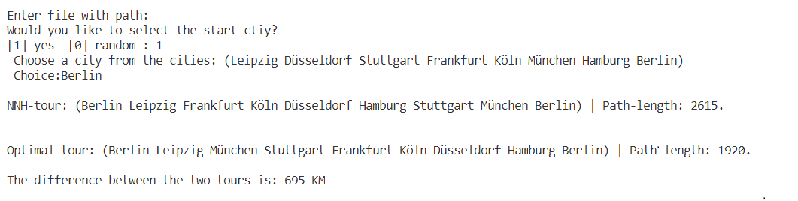
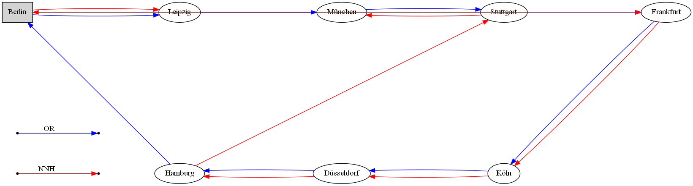

# PR3 -HA - TSP SOLVER

**Team-04: Orpheas Aggelidakis, Matthias Binder, Ali Babaoglu**

**Voraussetzungen: **
Um das Programm ausführen zu können brauchen Sie [Quicklisp](https://www.quicklisp.org/beta/),
[Graphviz](https://graphviz.org/download/) und [Clisp](https://sourceforge.net/projects/clisp/). Wenn Sie das Programm mit CLISP ausführen möchten dann brauchen Sie zusätzlich noch eine __[ASDF Version](https://common-lisp.net/project/asdf/archives/asdf.lisp) ab 3.x__ (am besten die aktuellste Version).  
_Wenn Sie nicht wissen wie und in welche Reihenfolge Sie die Komponenten installieren müssen dann schauen Sie sich dieses hilfreiche  **[Tutorial](https://www.youtube.com/watch?v=VnWVu8VVDbI&t=542s)** an._

 
Wie schon erwähnt müssen Sie die neuste ASDF Version besitzen wenn Sie das Programm mit Clisp ausführen möchten.
 

**Mit den folgenden Schritten können Sie ihre ASDF Version Updaten:**

1. Wenn Sie noch nicht Quicklisp installiert haben dann tuen Sie es.
2. Anschließend Navigieren Sie in ihren Quicklisp Ordner.
3. Dort finden Sie ihre asdf.lisp Datei. Öffnen Sie die Datei mit einem geeigneten Editor.
4. Ersetzten Sie durch Copy/Paste den Inhalt der asdf.lisp Datei mit der [ASDF Version](https://common-lisp.net/project/asdf/archives/asdf.lisp).
5. Anschließend binden Sie in der Datei **gv_drawer.lisp** ihre setup.lisp Datei ein welche sich ebenfalls im Quicklisp Ordner befindet.  Durch den Befehl `(load "*your_path_to_quicklispfolder/setup.lisp")` binden Sie die Datei ein.
6. Wenn Sie die vorherigen Schritte erfolgreich durchgeführten haben dann können Sie das Programm im Terminal mit folgen Befehl ausführen: `clisp pfad/tsp.lisp`
 

**Achtung:**
**Wenn beim Ausführen folgender Bug als Fehlermeldung erscheint:**  
*** - READ von
      #<INPUT BUFFERED FILE-STREAM CHARACTER #P"C:\\Users\\AliBa\\quicklisp\\dists\\quicklisp\\software\\inferior-shell-20160929-git\\utilities.lisp" @57>        
      : Ein Character mit Namen "cR" gibt es nicht.`  
 Dann navigieren Sie zum Pfad:` #P"C:\\Users\\AliBa\\quicklisp\\dists\\quicklisp\\software\\inferior-shell-20160929-git\\utilities.lisp"` und ersetzen Sie in Zeile 57 im Quellcode das "cr" mit einem "c"

### __Programmbedienung:__
1. Führen Sie das Programm mit `clisp pfad/tsp.lisp` aus
2. Anschließend Startet das Programm und eine beispielhafte Programm- Ein/Ausgabe wäre wie folgt:
 

Nach dem das Programm fertig ist, wird mit Graphviz eine .png Datei erstellt, die die Touren als Graphen darstellt.    Beispielhafter Graph wäre:
  

